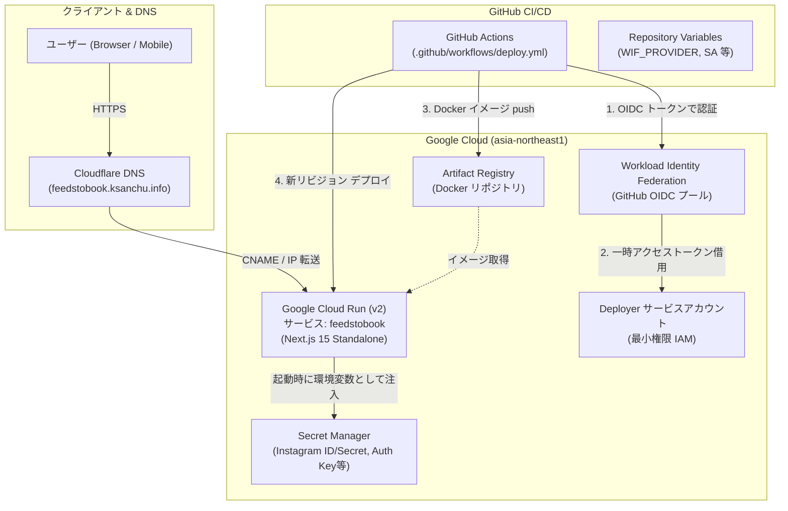

# インフラ基本設計書 (Infrastructure Design Document)

本ドキュメントは、FeedsToBook（`instagram-feed-epublisher`）のインフラストラクチャ構成、設計判断の背景・理由、および恒久的な運用・メンテナンス手順をまとめたものです。
将来の仕様変更やトラブルシューティング時に「なぜこの構成・設定になっているのか」を迅速に判断できるよう、決定の経緯と根拠を明記しています。

---

## 1. 概要と基本方針

### 1.1 システムの目的

Instagram 投稿を取得して EPUB（電子書籍）を生成・配布する Web アプリケーションを、セキュア・高可用・ゼロ運用コスト（低負荷時は完全無料待機）で安定稼働させる。

### 1.2 採用技術スタック一覧

| 分類                   | 採用技術・サービス                        | 選定理由・役割                                                     |
| :--------------------- | :---------------------------------------- | :----------------------------------------------------------------- |
| **実行基盤**           | **Google Cloud Run (v2)**                 | フルマネージド、リクエスト駆動のゼロスケール、コンテナベース       |
| **レジストリ**         | **Google Artifact Registry**              | Docker イメージ保管、東京リージョン内高速デプロイ                  |
| **機密情報管理**       | **Google Secret Manager**                 | 環境変数の安全な保管・実行時マウント、Git 漏洩防止                 |
| **インフラ管理 (IaC)** | **Terraform (Google Provider)**           | インフラ・権限のコード化、再現性の確保、設定ドリフト防止           |
| **CI/CD**              | **GitHub Actions**                        | 自動テスト・コンテナビルド・Cloud Run への自動デプロイ             |
| **CI/CD 認証**         | **Workload Identity Federation (WIF)**    | 秘密鍵（サービスアカウントキー JSON）不要のキーレス認証            |
| **DNS / ドメイン**     | **Cloudflare + Cloud Run Domain Mapping** | 独自ドメイン (`feedstobook.ksanchu.info`)、Google 自動証明書 (SSL) |

---

## 2. 全体アーキテクチャ



---

## 3. コンポーネント別・設計判断の根拠（なぜこうなっているのか）

### 3.1 アプリケーション実行基盤: Google Cloud Run (v2)

#### ① なぜ Cloud Run なのか

- **アイドル時のコストゼロ (ゼロスケール)**: アクセスがない時間帯はインスタンス数が 0 にスケールダウンし、料金が一切発生しません。個人開発・小規模運用において最も費用対効果が高い基盤です。
- **フルマネージド**: OS パッチ適用やサーバー監視が不要で、Next.js の Docker コンテナをそのまま実行できます。
- **v2 API (`google_cloud_run_v2_service`) の採用**: v1 と比較してコンテナ起動のオーバーヘッドが小さく、最新のヘルスチェックや柔軟なスケーリング設定に対応しています。

#### ② スペック・パラメータの決定理由

| 設定パラメータ          | 設定値                   | 決定理由・判断根拠                                                                                                                                                                                                                              |
| :---------------------- | :----------------------- | :---------------------------------------------------------------------------------------------------------------------------------------------------------------------------------------------------------------------------------------------- |
| **リージョン**          | `asia-northeast1` (東京) | 主たる利用者層（日本国内）に対するネットワークレイテンシを最小化するため。                                                                                                                                                                      |
| **メモリ**              | `2Gi`                    | **EPUB 生成時の画像展開対策**。Instagram から取得した複数の画像（数十枚）をメモリ上で展開・加工し、ZIP（EPUB）圧縮する処理を行うため、デフォルト（512Mi〜1Gi）では OOM（Out Of Memory）によるクラッシュのリスクがあるため余裕を持たせています。 |
| **CPU**                 | `1`                      | Next.js の SSR 処理および単一リクエストの画像処理に十分なスペック。                                                                                                                                                                             |
| **タイムアウト**        | `300s` (5分)             | **大量投稿の変換対策**。100件以上の投稿を一括で取得して EPUB 生成を行う場合、外部 API からの画像ダウンロードや圧縮処理に 1分以上要することがあるため、デフォルト（60秒）から 300秒に拡張しています。                                            |
| **最小インスタンス**    | `0`                      | コスト最優先。アクセスがない時は課金ゼロ。                                                                                                                                                                                                      |
| **最大インスタンス**    | `10`                     | 予期せぬトラフィック急増や DoS 攻撃によるクラウド費用の暴走を防ぐ安全防壁。                                                                                                                                                                     |
| **deletion_protection** | `false`                  | Terraform によるインフラ再構築（プロジェクト変更やリプレース）をスムーズに行えるよう無効化。                                                                                                                                                    |

---

### 3.2 コンテナ設計: Next.js Standalone + マルチステージビルド

#### ① なぜ `output: "standalone"` を採用したのか

通常の Next.js は本番環境でも巨大な `node_modules` を必要としますが、`next.config.mjs` で `output: "standalone"` を指定することで、Next.js は依存関係を静的解析し、**本番実行に本当に必要な最小限のファイル群のみ** を `.next/standalone` に出力します。
これにより、コンテナイメージサイズを **約 90MB** まで大幅削減し、Cloud Run のコールドスタート起動時間を劇的に短縮させています。

#### ② セキュリティとベースイメージ (Debian Bookworm Slim + Playwright)

- **非 root ユーザー実行**: コンテナ内部では `nodejs:nodejs`（UID 1001）ユーザーを作成し、一般ユーザーとして Next.js を実行しています。万が一アプリケーションに脆弱性があった場合でも、コンテナエスケープやホスト侵害を防止します。
- **Node.js 24 Bookworm Slim & Playwright Chromium**: EPUB の表紙画像を動的に生成するレンダラー（`cover-renderer.ts`）が Headless Chromium を必要とするため、Playwright 公式推奨の Debian ベースイメージを採用しています。コンテナ内に Chromium と実行依存ライブラリをプリインストールし、さらに日本語の文字化けを防ぐため `fonts-noto-cjk` を導入しています。
- **スタンドアロン環境での静的アセット・テンプレート配置**: Next.js の `standalone` ビルドは動的ファイル読み込み（`fs.readFile` や `@lesjoursfr/html-to-epub` の EJS テンプレート解決）の対象ファイルを自動バンドル対象外とすることがあります。そのため、EPUB 生成に必要な `book_layout`（CSS/アセット群）および `templates`（HTML/XHTMLテンプレート群）は Dockerfile の runner ステージで明示的に COPY 配置し、コード側（`epub-builder.ts`, `template-renderer.ts`）でも standalone 配下を含む動的フォールバック解決を行うことで、コンテナ上での安定した電子書籍出力を保証しています。

---

### 3.3 機密情報管理: Google Secret Manager

#### ① なぜ Secret Manager なのか

Instagram API シークレットや認証暗号鍵などの機密情報を、ソースコード（Git）や Docker イメージに一切埋め込まず、Cloud Run の起動時に環境変数としてメモリ上に安全にマウントします。

#### ② Terraform での初期バージョン管理と `ignore_changes`

Cloud Run は、環境変数として指定されたシークレットが存在しない（バージョンがない）状態では起動に失敗します。
そのため、Terraform（`terraform/secrets.tf`）側で初期バージョン（プレースホルダー）を一度だけ自動作成し、同時に `lifecycle { ignore_changes = [secret_data] }` を指定しています。
この設計により、**開発者が `gcloud` コマンド等で後から本物の機密値を注入しても、以降の `terraform apply` で値がリセットされる事故を完全に防止** しています。

#### ③ 管理対象の機密環境変数一覧 (Secret Manager)

| 環境変数名                | 用途                                      | 補足                                                          |
| :------------------------ | :---------------------------------------- | :------------------------------------------------------------ |
| `INSTAGRAM_CLIENT_ID`     | Meta for Developers のアプリ ID           | 数値文字列。Meta 親アプリIDではなく Instagram API 設定側の ID |
| `INSTAGRAM_CLIENT_SECRET` | Meta for Developers のアプリ シークレット | 機密値                                                        |
| `BETTER_AUTH_SECRET`      | セッション署名・暗号化用のランダム文字列  | 32バイト以上（`openssl rand -hex 32`）                        |
| `BETTER_AUTH_URL`         | 認証コールバックベース URL                | 独自ドメイン開通前は Cloud Run URL、開通後はカスタムドメイン  |

#### ④ 公開環境変数（`NEXT_PUBLIC_*`）のビルド時注入方針

`NEXT_PUBLIC_CONTACT_FORM_URL`（法的ページからのお問い合わせ Google フォーム等のリンク先）は、Next.js の仕様上 `next build` 時にクライアントバンドルおよび静的生成（SSG）ページ内にインライン展開（DefinePlugin でハードコード）されます。
そのため、実行時に Secret Manager 経由でマウントしても反映されません。また、本 URL はブラウザ上でエンドユーザーに公開されるものであり機密値ではありません。
したがって、Secret Manager ではなく GitHub Actions の **Repository Variables (`vars.NEXT_PUBLIC_CONTACT_FORM_URL`)** で管理し、Docker ビルド時の引数（`--build-arg NEXT_PUBLIC_CONTACT_FORM_URL=...`）として注入する構成を採用しています（未設定時はコードデフォルトの GitHub Issues URL へ安全にフォールバック）。

---

### 3.4 CI/CD 認証 & 権限: Workload Identity Federation (WIF)

#### ① なぜサービスアカウントキー（JSON）を廃止したのか

従来の「サービスアカウントキー（JSON ファイル）」は、有効期限がなく、ローカルや GitHub Secrets に永続的に保存されるため、漏洩時のセキュリティリスクが極めて高い課題がありました。
WIF を採用することで、GitHub Actions の実行ごとに **GitHub が発行する OIDC トークンを GCP が検証し、短命（1時間以内）の一時アクセストークンを自動発行** する「完全なキーレス認証」を実現しています。

#### ② なぜ GitHub Actions の「Variables (`vars`)」で管理するのか

WIF プロバイダ名（`projects/xxx/...`）やサービスアカウントのメールアドレスは、接続先のリソース識別子（アドレス）に過ぎず、**それ単体では秘密情報ではありません**。
第三者にこの文字列が漏洩しても、GitHub 側のリポジトリ名（`repo:1021ky/instagram-feed-epublisher:*`）が一致する GitHub Actions からでなければ GCP 側で拒否されます。
そのため、GitHub 側で不要な Secrets を増やさず、設定値として **Variables (`vars`)** で透明性高く管理するのがベストプラクティスです。

#### ③ デプロイ用サービスアカウントの最小権限（Least Privilege）徹底

デプロイ担当のサービスアカウント（`github-actions-deployer`）には、必要最小限の権限のみを付与しています：

- `roles/run.admin`: Cloud Run サービス・リビジョンの更新に必要。
- `roles/artifactregistry.writer`: ビルドした Docker イメージの push に必要。
- `roles/iam.serviceAccountUser`: **プロジェクト全体ではなく、Cloud Run ランタイムサービスアカウント（`feedstobook-runner`）に対してのみリソースレベルで付与**。これにより、プロジェクト内の他サービスアカウント（Default Compute SA 等）への不正な権限借用を防止。
- ※ `roles/secretmanager.secretAccessor` はデプロイヤには付与していません（デプロイフローでシークレットの値を読み取る必要はなく、実行時に読み取るのは Cloud Run ランタイム SA であるため）。

---

### 3.5 独自ドメイン & ネットワーク: Cloudflare + Cloud Run Domain Mapping

#### ① 独自ドメイン構成

- **本番ドメイン**: `feedstobook.ksanchu.info`
- **SSL/TLS**: Google マネージド証明書（自動更新・無料）

#### ② なぜ `enable_custom_domain` フラグでオプショナル化したのか

Cloud Run のドメインマッピング（`google_cloud_run_domain_mapping`）を作成するには、親ドメイン `ksanchu.info` の所有権が Google Search Console（Webmaster Central）で事前に確認されている必要があります。
DNS 伝播や所有権確認には時間がかかるため、**初期構築時はドメインマッピングを無効（`enable_custom_domain = false`）に設定** しています。これにより、ドメイン認証の完了を待つことなく、Cloud Run デフォルト URL（`https://feedstobook-xxxxx-an.a.run.app`）でアプリの先行稼働や CI/CD の動作確認を行えるようにしています。

---

## 4. 恒久的メンテナンス・運用手順 (Operations Runbook)

### 4.1 機密値（APIシークレット等）の更新手順

Instagram API シークレットの再発行や認証暗号鍵を変更する場合は、末尾改行（`\n`）の混入を防ぐため `echo -n` を用いて Secret Manager に新しいバージョンを追加します。

```bash
PROJECT_ID="feeds-to-book"

# 例: Instagram API シークレットを再発行した場合
echo -n "NEW_INSTAGRAM_CLIENT_SECRET" | gcloud secrets versions add INSTAGRAM_CLIENT_SECRET \
  --project="${PROJECT_ID}" --data-file=-

# 例: BETTER_AUTH_URL を独自ドメインに更新する場合
echo -n "https://feedstobook.ksanchu.info" | gcloud secrets versions add BETTER_AUTH_URL \
  --project="${PROJECT_ID}" --data-file=-
```

> [!TIP]
> シークレットを更新した後、Cloud Run に即座に反映させるには、GitHub Actions でデプロイを実行するか、以下のコマンドでリビジョンを再デプロイします：
>
> ```bash
> gcloud run services update feedstobook --region=asia-northeast1 --project=feeds-to-book
> ```

---

### 4.2 お問い合わせ URL（公開環境変数）の変更手順

お問い合わせフォーム（Google Forms 等）の URL は、Next.js のビルド時に埋め込まれる公開設定です。変更する場合は GitHub リポジトリの Variables を更新し、再デプロイを実行します。

1. GitHub リポジトリの **Settings** → **Secrets and variables** → **Actions** → **Variables** タブを開きます。
2. `NEXT_PUBLIC_CONTACT_FORM_URL` の値を新しいフォーム URL（例: `https://forms.gle/NEW_FORM_ID`）に更新します（初回は「New repository variable」から追加）。
3. GitHub Actions の `deploy.yml` ワークフローを手動実行（または `main` への push）すると、新しい URL を引数としてコンテナイメージが再ビルドされ、自動的に本番へ反映されます。

---

### 4.3 独自ドメイン (`feedstobook.ksanchu.info`) の有効化手順

Google Search Console で親ドメイン `ksanchu.info` の所有権確認（TXT レコード認証）が完了した後の手順です。

#### 手順 1: Terraform でドメインマッピングを有効化

```bash
cd terraform
terraform apply -var="project_id=feeds-to-book" -var="enable_custom_domain=true"
```

#### 手順 2: 出力された DNS レコードの確認

```bash
terraform output dns_records
```

#### 手順 3: Cloudflare へのレコード追加

Cloudflare の DNS 管理画面を開き、サブドメイン `feedstobook` に対して出力されたレコード（CNAME: `ghs.googlehosted.com.` または A/AAAA レコード）を追加します。
※ DNS 設定後、Google マネージド証明書が自動発行され、数分〜15分程度で HTTPS 接続が有効化されます。

---

### 4.4 CI/CD の手動デプロイ手順

デプロイワークフロー（`.github/workflows/deploy.yml`）は通常 `main` ブランチへの push 時に自動実行されますが、手動で任意のブランチからデプロイすることも可能です。

```bash
# 特定ブランチから手動デプロイを実行
gh workflow run deploy.yml --ref infra/issue-57-docker-cloud-run

# 実行ログの監視
gh run watch
```

---

### 4.5 インフラ設定（スペック・環境変数等）の変更フロー

インフラリソース（メモリ、CPU、環境変数定義等）を変更する際は、必ず Terraform コード経由で反映します。

1. `terraform/*.tf` を編集（例: メモリを 4Gi に変更、シークレットを追加など）。
2. コードの整形と構文チェックを実行：

   ```bash
   pnpm terraform:fmt
   pnpm terraform:validate
   ```

3. 差分確認と適用：

   ```bash
   cd terraform
   terraform plan -var="project_id=feeds-to-book"
   terraform apply -var="project_id=feeds-to-book"
   ```
