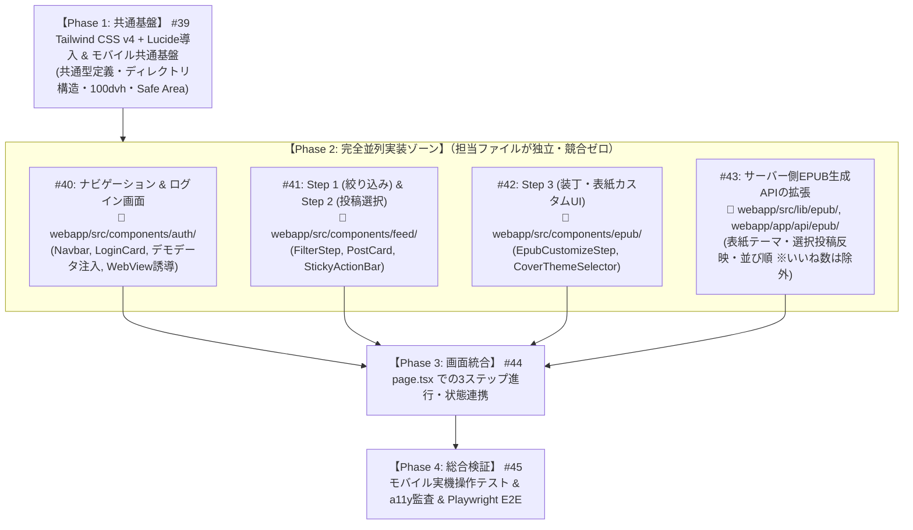

# アプリデザイン刷新 (v2) Issue一覧

本ドキュメントは、Instagram Feed Epublisher のデザイン刷新およびモバイル最適化（Step 形式 UI、Tailwind CSS v4 導入、デモモード等）を並列開発しやすいように分割した Issue 仕様書です。

---

## 依存関係・並列実装マップ

---

## Issue #1 (#39): 【基盤】Tailwind CSS v4 & Lucide Icons の導入とモバイル共通 CSS 基盤

### タイトル

`[UI基盤] Tailwind CSS v4 & Lucide Iconsの導入とモバイル共通CSS・型定義の整備`

### 目的・背景

プロトタイプ（`feeds2epub_proto`）のデザインを忠実に再現しつつ、スマートフォンでの操作性を高めるために、Tailwind CSS v4 および Lucide Icons を正式に導入する。後続の並列実装でコンフリクトが発生しないよう、共通の型定義・ディレクトリ構造・モバイルスケーリング設定（100dvh、Safe Area）を先行して整備する。

### ゴール & 作業内容

1. **パッケージ追加 (Exact Version)**:
   - `@tailwindcss/postcss`, `tailwindcss`, `lucide-react` を `webapp/package.json` に追加。
2. **Tailwind CSS v4 設定**:
   - `webapp/app/globals.css` に Tailwind v4 インポートディレクティブを設定。
   - モバイル向けのビューポート高さ（`100dvh`）や iOS セーフエリア（`env(safe-area-inset-bottom)`）ユーティリティを定義。
3. **共通型定義の作成**:
   - `webapp/src/types/ui.ts`（フィルター条件、EPUB設定、投稿アイテム、デモデータ型など）。
4. **ディレクトリ雛形の作成**:
   - `webapp/src/components/auth/`
   - `webapp/src/components/feed/`
   - `webapp/src/components/epub/`
   - `webapp/src/components/common/`

### 受入基準 (Acceptance Criteria)

- [ ] `pnpm build` が警告・エラーなく通過すること。
- [ ] Tailwind CSS のユーティリティクラス（`bg-zinc-100`, `text-rose-500` 等）が正常に反映されること。
- [ ] Lucide アイコンが正常に描画できること。
- [ ] 既存の単体テストがパスすること。

### 変更対象ファイル

- `webapp/package.json`
- `webapp/pnpm-lock.yaml`
- `webapp/app/globals.css`
- `webapp/src/types/ui.ts` (新規)

---

## Issue #2 (#40): 【並列A】ナビゲーション & ログイン画面 & デモ体験モード & WebView 誘導の実装

### タイトル

`[UI] ナビゲーションバー、ログインカード、デモ体験モード、Instagram WebView誘導バナーの実装`

### 目的・背景

洗練されたビジュアルのヘッダーとログインカードを実装する。また、Instagram アプリ内ブラウザ（WebView）によるファイルダウンロード不可問題を回避するための案内バナーと、Meta ログインなしでも機能を即座に試せる「デモデータ体験モード」を設ける。

### ゴール & 作業内容

1. **モバイル対応ヘッダー (`Navbar.tsx`)**:
   - アカウント情報（アイコン、`@username`）、ログアウトボタン、Kindle 対応バッジ。
2. **ログインカード (`LoginCard.tsx`)**:
   - プロトタイプ風のグラデーション Instagram アイコン、アプリの価値説明（100日チャレンジ、タグ絞り込み、表紙付きEPUB）。
   - 「Instagramでログイン」ボタン（Better Auth リダイレクト連携）。
3. **デモデータ体験ボタン & サンプルデータ (`sampleData.ts`)**:
   - 「デモデータ（100日チャレンジ）ですぐに体験」ボタン。
   - 押下時にモック投稿データ（約100件）を注入し、Step 2 へ遷移するコールバック。
4. **Instagram WebView 検知バナー (`InAppBrowserAlert.tsx`)**:
   - User-Agent で Instagram / Facebook アプリ内ブラウザを検知した場合に、「右上の『…』からSafari/Chromeなどのブラウザで開いてください（EPUB保存のため）」という注意喚起バナーを表示。

### 受入基準 (Acceptance Criteria)

- [ ] 未ログイン時に魅力的なログインカードが表示されること。
- [ ] 「デモデータで体験」を押すと、Meta ログインなしでデモデータが注入されること。
- [ ] Instagram 内ブラウザで開いた際に案内バナーが表示されること。
- [ ] モバイル幅（375px〜）で崩れなく綺麗に表示されること。

### 変更対象ファイル

- `webapp/src/components/auth/Navbar.tsx` (新規)
- `webapp/src/components/auth/LoginCard.tsx` (新規)
- `webapp/src/components/auth/InAppBrowserAlert.tsx` (新規)
- `webapp/src/lib/demo/sampleData.ts` (新規)

---

## Issue #3 (#41): 【並列B】Step 1（絞り込み）& Step 2（投稿確認・選択・固定バー）の実装

### タイトル

`[UI] Step 1 絞り込みフォーム & Step 2 モバイル向け投稿確認・選択リストの実装`

### 目的・背景

プロトタイプの縦積み長大スクロールを解消し、スマホで快適に操作できる絞り込みフォームと投稿リストを実装する。絞り込み完了後はフォームをコンパクトに折りたたみ、画面下部に親指で届く固定バー（Sticky Action Bar）を配置する。

### ゴール & 作業内容

1. **Step 1: 絞り込みフォーム (`FeedFilterStep.tsx`)**:
   - ハッシュタグ入力 ＋ よく使うタグボタン（`#100日チャレンジ` 等）。
   - 期間指定 ＋ プリセットボタン（「直近100日」「直近30日」「全期間」）。
   - 取得件数スライダー（10〜500件）。
   - 取得完了時は「#100日チャレンジ / 直近100日 / 84件取得中」のようなサマリー表示に自動折りたたみ（タップで再展開）。
2. **Step 2: 投稿確認・選択リスト (`PostListStep.tsx`, `PostCard.tsx`)**:
   - スマホに最適化された縦1列のカードレイアウト（サムネイル画像＋日付＋キャプション冒頭＋いいね数）。
   - カード全体またはチェックボックスをタップして EPUB への収録/除外をトグル。
   - 「すべて選択」「選択解除」ボタン、キャプション内キーワード検索。
3. **画面下部固定アクションバー (`StickyActionBar.tsx`)**:
   - 画面最下部に常時固定（`fixed bottom-0` / Safe Area 対応）。
   - 「選択中: 〇件」の表示と、「本の設定に進む →」ボタン。

### 受入基準 (Acceptance Criteria)

- [ ] 日付プリセット（直近100日など）でワンタップ入力できること。
- [ ] 取得完了後にフィルターが自動で折りたたまれ、一覧が主役になること。
- [ ] カード内のチェックボックスで投稿を1件ずつ除外/選択できること。
- [ ] 画面下部の固定バーからいつでも次のステップに進めること。
- [ ] タップ領域が 44×44px 以上確保されていること。

### 変更対象ファイル

- `webapp/src/components/feed/FeedFilterStep.tsx` (新規)
- `webapp/src/components/feed/PostListStep.tsx` (新規)
- `webapp/src/components/feed/PostCard.tsx` (新規)
- `webapp/src/components/feed/StickyActionBar.tsx` (新規)

---

## Issue #4 (#42): 【並列C】Step 3（EPUB 表紙テーマ・装丁設定 UI）の実装

### タイトル

`[UI] Step 3 EPUB表紙テーマ選択・装丁設定・エクスポート進捗モーダルの実装`

### 目的・背景

Kindle や電子書籍リーダーで美しく読める電子書籍に仕立てるための設定 UI を実装する。5色の表紙カラーテーマ、並び順（Day 1→100 推奨）、タイトル・著者名入力を提供し、エクスポート完了後には Kindle への転送方法ガイドを表示する。

### ゴール & 作業内容

1. **装丁設定フォーム (`EpubCustomizeStep.tsx`)**:
   - 書籍タイトル（デフォルト: `@usernameの投稿記録` 等）、サブタイトル、著者名。
   - 掲載順序の選択（古い順: `Day 1 → 100` 推奨 / 新しい順）。
2. **表紙テーマセレクター (`CoverThemeSelector.tsx`)**:
   - 5種類のカラーテーマ（濃紺: チャレンジ、スレート: モダン、アイボリー: エディトリアル、白: ミニマル、紫: ダーク）のビジュアルカード選択。
3. **エクスポートモーダル & ガイド (`ExportModal.tsx`)**:
   - 生成中のローディングスピナー / プログレス表示。
   - ダウンロード完了後の案内（「Send to Kindle」での転送方法、Apple Books / Kobo での閲覧手順）。

### 受入基準 (Acceptance Criteria)

- [ ] 5種類の表紙テーマが視覚的にわかりやすく選択できること。
- [ ] 並び順（古い順 / 新しい順）が指定できること。
- [ ] 「EPUBをダウンロード」ボタン押下でダウンロードが開始されること。
- [ ] ダウンロード完了後に Kindle 等での利用ガイドが表示されること。

### 変更対象ファイル

- `webapp/src/components/epub/EpubCustomizeStep.tsx` (新規)
- `webapp/src/components/epub/CoverThemeSelector.tsx` (新規)
- `webapp/src/components/epub/ExportModal.tsx` (新規)

---

## Issue #5 (#43): 【並列D・API】サーバー側 EPUB 生成 API の拡張（表紙テーマ・選択投稿・並び順反映）

### タイトル

`[API] EPUB生成バックエンドの拡張（表紙テーマ・除外投稿・並び順対応 ※ポリシー準拠）`

### 目的・背景

フロントエンドで指定された「ユーザーが選んだ投稿（除外されていないもの）」「表紙テーマ」「並び順」をサーバー側の EPUB 生成ロジック（`@lesjoursfr/html-to-epub`）に反映する。また、プロダクトポリシーに基づき、いいね数などの SNS 付与情報は書籍 HTML から厳密に除外する。

### ゴール & 作業内容

1. **API スキーマの拡張 (`app/api/epub/route.ts`)**:
   - POST ペイロードに `coverTheme`, `sortOrder`, `selectedMediaIds`（または除外リスト）を受け取れるように型・バリデーションを拡張。
2. **EPUB ビルダーの改修 (`lib/epub/epub-builder.ts`)**:
   - `sortOrder`（`asc` または `desc`）に基づく投稿の並び替え。
   - `selectedMediaIds` によるフィルタリング（チェックを外した投稿を除外）。
   - `coverTheme` に応じた表紙 HTML/CSS テンプレートの適用（5色のカラーパレット・タイポグラフィ）。
3. **【ポリシー準拠】**:
   - 本文 HTML 生成処理において、いいね数・コメント数などの情報は出力しないことを徹底。

### 受入基準 (Acceptance Criteria)

- [ ] 選択された投稿のみが EPUB に含まれること。
- [ ] 指定した表紙テーマ（背景色・アクセントカラー）が EPUB 表紙に反映されること。
- [ ] 指定した並び順（昇順 / 降順）で章が並ぶこと。
- [ ] EPUB 本文内に「いいね数」「コメント数」等の情報が一切含まれていないこと。
- [ ] バックエンド単体テスト（Vitest）がすべてパスすること。

### 変更対象ファイル

- `webapp/src/lib/epub/types.ts`
- `webapp/src/lib/epub/epub-builder.ts`
- `webapp/src/lib/epub/themes.ts` (新規: 表紙テーマ定義)
- `webapp/app/api/epub/route.ts`
- `webapp/src/lib/epub/__tests__/epub-builder.test.ts`

---

## Issue #6 (#44): 【統合】`page.tsx` での 3 ステップ進行・状態連携

### タイトル

`[UI統合] page.tsxにおける3ステップUIの連携と状態管理の実装`

### 目的・背景

Issue #2 〜 #5 で独立して開発された各コンポーネントを `webapp/app/page.tsx` に集約し、スムーズなステップ進行・データ受け渡し・API 呼び出しを結合する。

### ゴール & 作業内容

1. **ステップ管理（State Machine）**:
   - 現在のステップ（`step: 1 | 2 | 3`）の状態管理。
   - 「Step 1: 取得完了」→「Step 2: 一覧選択へ自動スクロール/展開」→「Step 3: 装丁設定へ」の遷移制御。
2. **実データ / デモデータの切り替え**:
   - Instagram ログイン時は実 Graph API から取得、デモモード時はサンプルデータを流し込む透過的なデータフロー。
3. **EPUB 生成リクエストの送信**:
   - Step 3 で「ダウンロード」押下時に、選択済み投稿・表紙テーマ・タイトル等をペイロードに含めて `/api/epub` を呼び出し、Blob ダウンロードをトリガー。

### 受入基準 (Acceptance Criteria)

- [ ] 未ログイン画面 → ログイン / デモ体験 → Step 1 → Step 2 → Step 3 の一連のユーザーフローが完動すること。
- [ ] ステップ間を自由に行き来（前のステップに戻って再選択）できること。
- [ ] EPUB 生成が成功し、ブラウザでダウンロードできること。

### 変更対象ファイル

- `webapp/app/page.tsx`

---

## Issue #7 (#45): 【総合検証】モバイル実機検証 & アクセシビリティ・E2E テストの更新

### タイトル

`[QA/Test] モバイル実機検証、アクセシビリティ監査、Playwright E2Eテストの更新`

### 目的・背景

デザイン刷新後のアプリが、対象ユーザーのメイン環境であるスマートフォン（iOS Safari / Android Chrome）で快適に動作し、アクセシビリティ標準を満たしていることを最終検証する。また CI で自動検証できるよう Playwright テストを更新する。

### ゴール & 作業内容

1. **モバイル実機・エミュレータ検証**:
   - iPhone (Safari) / Android (Chrome) での動作確認。
   - タッチ領域（44px 以上）、スクロールのスムーズさ、キーボード表示時のレイアウト崩れ防止。
2. **アクセシビリティ (a11y) 監査**:
   - コントラスト比（WCAG AA 基準: 4.5:1 以上）の確認。
   - スクリーンリーダー対応（適切な `aria-label`, セマンティック見出し順）。
3. **Playwright E2E テストの更新**:
   - モバイルビューポート（iPhone 14 / Pixel 7 設定）でのテストケース追加。
   - デモモードのステップ遷移〜EPUB ダウンロード完了までの自動テスト実行。

### 受入基準 (Acceptance Criteria)

- [ ] Playwright E2E テスト（デスクトップ & モバイル）がすべてパスすること。
- [ ] Lighthouse / Axe 等による a11y 警告・重大な指摘がゼロであること。
- [ ] スマホ実機で誤タップや崩れがなくスムーズに操作できること。

### 変更対象ファイル

- `webapp/playwright.config.ts`
- `webapp/e2e/...`
